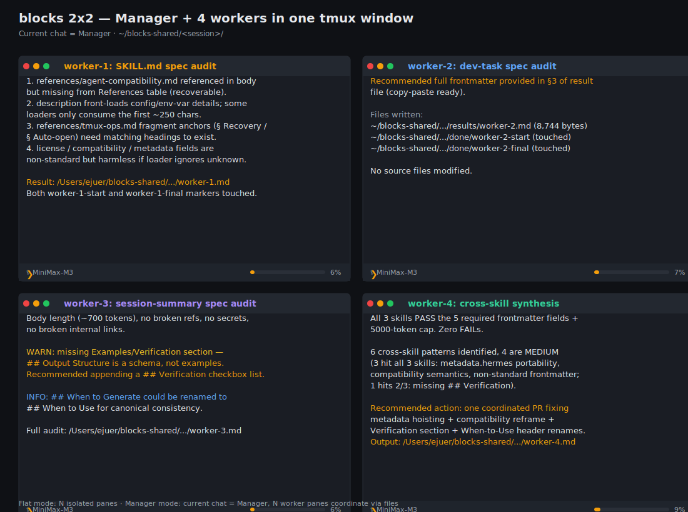

| English | [中文](README_zh.md)

# Agent Skills

[](https://github.com/hooooolea/agent-skills)
[](LICENSE)
[](https://agentskills.io)

**三个 SKILL.md，跨 Hermes / Claude Code / Codex / Aider。** 任何支持 [SKILL.md 开放标准](https://agentskills.io/specification) 的 agent 都能装。

## Quickstart

Three steps to get all 3 skills running on any agent:

1. **Download the SKILL.md files** — clone the repo (or just download the 3 folders you want):
   ```bash
   # Option A: full repo (lets you read source, file issues, send PRs)
   git clone https://github.com/hooooolea/agent-skills ~/agent-skills

   # Option B: tarball only (no git, smallest)
   curl -fsSL https://github.com/hooooolea/agent-skills/archive/refs/heads/main.tar.gz | tar xz
   ```

2. **Copy into your agent's skills directory**:

   | Agent | Path | Layout |
   |-------|------|--------|
   | Hermes | `~/.hermes/skills/` | flat: `<name>/SKILL.md` |
   | Claude Code | `~/.claude/skills/` | needs `<category>/<name>/` subdir |
   | Codex | `~/.codex/skills/` | flat: `<name>/SKILL.md` |
   | Aider | per-repo `.aider/skills/` | flat: `<name>/SKILL.md` |

   ```bash
   # Hermes / Codex / Aider (flat)
   cp -r ~/agent-skills/skills/* ~/.hermes/skills/    # or ~/.codex/skills/

   # Claude Code (category subdir required)
   cp -r ~/agent-skills/skills/agentic/blocks         ~/.claude/skills/blocks
   cp -r ~/agent-skills/skills/productivity/dev-task  ~/.claude/skills/dev-task
   cp -r ~/agent-skills/skills/productivity/session-summary ~/.claude/skills/session-summary
   ```

3. **Restart your agent**, then in chat say one of:
   - "用 2x2 跑 4 个 agent 对比 X" → triggers `blocks`
   - "实现 / 开发 / 改代码" → triggers `dev-task`
   - "session 收尾 / 存个档" → triggers `session-summary`

> 💡 **Don't want to copy manually?** Vercel's [`npx skills add hooooolea/agent-skills`](https://github.com/vercel-labs/skills) CLI does the clone + cp + agent-detection for you (50+ agents supported). But it's a wrapper, not a requirement — the SKILL.md open standard works without any tooling.

## What Are Agent Skills?

A Skill is a folder containing a `SKILL.md` Markdown file with YAML frontmatter. [Anthropic released the spec in October 2025](https://www.anthropic.com/news/skills) and open-sourced it in December 2025; Claude Code, OpenAI Codex, Cursor, Gemini CLI, Hermes, Antigravity, Windsurf, and 50+ other agents support it today.

### Folder structure

```
skill-name/
├── SKILL.md          # Required: name + description frontmatter + Markdown body
├── scripts/          # Optional: helper shell / python
├── templates/        # Optional: starter files
└── references/       # Optional: detailed docs loaded on demand
```

### How it works: progressive disclosure

Skills load in 3 tiers so a single agent can host hundreds of skills without blowing its context window:

| When | What loads | Token cost |
|------|------------|------------|
| Session start | Every skill's `name` + `description` (frontmatter only) | ~100 tokens × N |
| Agent decides a skill is relevant | That skill's full `SKILL.md` body | ≤ 5000 tokens, 1 skill |
| Body links to `references/<file>.md` | Just the linked reference | on-demand |

### How it compares

| Approach | Spec | Runtime | Portable across agents |
|---------|------|---------|------------------------|
| **SKILL.md** (this repo) | Open standard | None (pure Markdown) | ✅ 50+ agents |
| MCP server | Open standard | Need to run a server | ✅ MCP clients |
| function calling | Vendor-specific | Need to ship code | ❌ per agent |
| system prompt stuffing | None | None | ❌ context explodes past 10 skills |

### This repo

Three skills written to this spec: [blocks](skills/agentic/blocks/SKILL.md) (multi-agent coordination in tmux) · [dev-task](skills/productivity/dev-task/SKILL.md) (multi-subagent dev workflow) · [session-summary](skills/productivity/session-summary/SKILL.md) (session handoff).



## Features

- **跨 agent** — 同一份 SKILL.md 在 Hermes / Claude Code / Codex / Aider 都能跑（profile flag / worktree / slash command 的差异见 [compat 表](skills/agentic/blocks/references/agent-compatibility.md)）
- **Open standard** — 严格遵守 [agentskills.io spec](https://agentskills.io/specification)
- **零依赖** — 纯 Markdown + 可选 shell 脚本，无需 npm / pip
- **小 footprint** — 每个 SKILL.md body ≤ 500 行 / ≤ 5000 tokens
- **可发现** — 仓库结构兼容 Vercel `npx skills` CLI / SkillsMP.com auto-index

## Skills

- **[blocks](skills/agentic/blocks/SKILL.md)** — 一个 tmux 窗口跑 N 个并行 AI agent（Manager + Workers 协调跑多步任务）
- **[dev-task](skills/productivity/dev-task/SKILL.md)** — 多子代理开发流（5-phase: 拆任务→探索→编码→审查→收尾）
- **[session-summary](skills/productivity/session-summary/SKILL.md)** — session 结束前存个档，下次接着干

## When NOT to use

- 你要写的是 agent framework / runtime / SDK — 那是 `hermes-agent` / `claude-code` 本体的事，不是 skill 的事
- 工作流是一次性的（不会重复 2 次）— 写 prompt 比写 SKILL.md 快
- 需要 GUI / IDE 集成 — skill 是纯文本约定，没有 UI 规范
- 你已经有成熟的工作流（> 1 年积累） — 那应该 fork 维护成自己的 private repo，而不是从零写

## Contributing

Issues / PRs 都欢迎。改 SKILL.md 前先读 [agentskills.io spec](https://agentskills.io/specification)。跨 agent 兼容性的差异点统一在 [agent-compatibility.md](skills/agentic/blocks/references/agent-compatibility.md) 维护。

每个 PR 触发 CI 跑 [check-skill-spec.py](https://github.com/hooooolea/hermes-agent/blob/main/skills/software-development/hermes-agent-skill-authoring/scripts/check-skill-spec.py)：description ≤ 1024 chars、name 匹配父目录、body ≤ 500 行、无 `or types /<name>` 触发。

## Resources

### Official documentation
- [agentskills.io spec](https://agentskills.io/specification) — the open standard
- [Anthropic skills announcement](https://www.anthropic.com/news/skills) (Oct 2025) — the original writeup

### Community
- [ComposioHQ/awesome-claude-skills](https://github.com/ComposioHQ/awesome-claude-skills) — 1000+ skills curated list
- [Vercel `npx skills` CLI](https://github.com/vercel-labs/skills) — cross-agent install (50+ agents)
- [SkillsMP.com](https://skillsmp.com) — auto-index of public GitHub SKILL.md

### Inspiration
- [Anthropic skills repo](https://github.com/anthropics/skills) — example skills
- [Lenny's Newsletter](https://www.lennysnewsletter.com/p/everyone-should-be-using-claude-code) — 50 agent coding use cases
- [Notion Agent Skills](https://www.notion.so/notiondevs/Notion-Skills-for-Claude-28da4445d27180c7af1df7d8615723d0) — Notion integration
- [Top Agent Skills](https://composio.dev/content/top-claude-skills) — community ranking

## Acknowledgments

- [Anthropic](https://www.anthropic.com/) — published the SKILL.md open standard
- [Vercel](https://vercel.com/) — `npx skills` CLI cross-agent install
- [ComposioHQ](https://github.com/ComposioHQ/awesome-claude-skills) — community curation
- [SkillsMP](https://skillsmp.com) — auto-index of public SKILL.md

## Community

没 Discord — 用 GitHub Issues / Discussions 凑合：
- [Issues](https://github.com/hooooolea/agent-skills/issues) — bug / feature request
- [Discussions](https://github.com/hooooolea/agent-skills/discussions) — Q&A / 想法

## Live site

GitHub Pages 镜像：<https://hooooolea.github.io/agent-skills/>

---

MIT
