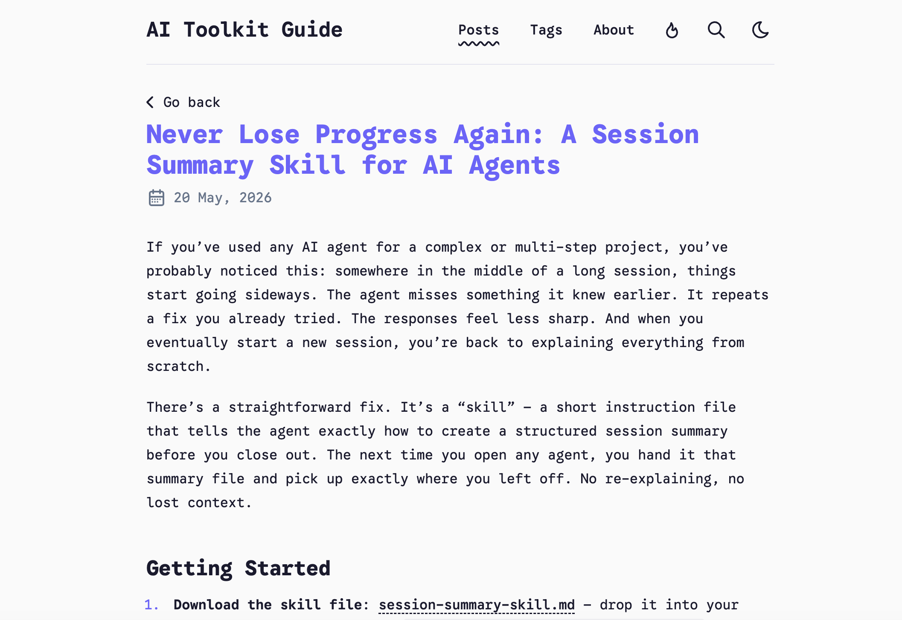

[English](README.md) | 中文

<div align="center">

# Agent Skills

_Hermes Agent 的 SKILL.md 集合 — 直接用的并行 Agent 编排、写博客、多 Agent MVP、Spring Boot 测试等 skill。_


</div>

---

## 这里有什么

每个 skill 都是一个 `SKILL.md` 文件，扔到 `~/.hermes/skills/<name>/`（或你 agent 对应的目录）就能用。不用 npm install，不用 Python venv，不用 API key —— 就是 markdown，教你的 agent 什么时候用、怎么用好。

| Skill | 分类 | 一句话 |
|-------|------|--------|
| **[session-summary](./SKILL.md)** | productivity | 任何 session 结束前存档到 `.session_summary.md`；下次打开秒速续上 |
| **[blocks](./skills/agentic/blocks/SKILL.md)** | agentic | 一个 tmux 窗口起 N 个并行 Hermes agent — flat（独立）或 manager（协调） |
| **[multi-agent-mvp-startup](./skills/agentic/multi-agent-mvp-startup/SKILL.md)** | agentic | 启动多 agent MVP 项目（后端 + 前端） |
| **[ejuerz-blog-writing](./skills/productivity/ejuerz-blog-writing/SKILL.md)** | productivity | 写英文 AI 工具博客到 ejuerz.com（Astro 6 + AdSense） |
| **[dev-task](./skills/productivity/dev-task/SKILL.md)** | productivity | 5 阶段多子代理开发流（拆 → 探 → 写 → 审 → 收） |
| **[spring-boot-mybatisplus-unit-test](./skills/development/spring-boot-mybatisplus-unit-test/SKILL.md)** | development | Spring Boot + MyBatis-Plus service 层单测（Mockito） |

按分类浏览：[`agentic/`](./skills/agentic/) · [`productivity/`](./skills/productivity/) · [`development/`](./skills/development/)

---

## 主推：blocks

仓库的招牌 skill。让你在一个终端窗口里跑 **N 个并行 Hermes agent**：

```bash
# 在任何 Hermes session 里：
/blocks --manager --workers 4
# 或者直接说人话：
"分配 4 个员工"
```

发生了什么：
1. 你当前的对话变成 **Manager**（不开新 tmux pane）。
2. 弹出 4 个 worker pane（tmux 网格），同时 Terminal.app 窗口自动弹出。
3. 你给任务 → Manager 拆 4 个子任务派下去。
4. Workers 并行跑，结果写到 `~/blocks-shared/<session>/results/`，完成时 touch done。
5. Manager 汇总，回主对话汇报。

支持两种模式：
- **Flat** — N 个独立 pane，你驱动每一个
- **Manager** — 1 Manager + N Workers，文件协调，避免重复劳动

[→ 完整文档在 `skills/agentic/blocks/SKILL.md`](./skills/agentic/blocks/SKILL.md)

---

## 主推：session-summary

AI Agent 聊得越久越傻。早期的细节忘了，说过的话重复了，思路开始飘。关掉重开？又得从头解释一遍项目。

**Session Summary** 解决这个。一个文件。一个习惯。进度不再丢。

```bash
# session 结束 — 存档
"总结一下这次 session，写到 .session_summary.md"

# 下次 session — 秒速续上
"读 .session_summary.md，从上次停的地方继续"
```

### 存什么

| 段 | 追踪什么 |
|----|---------|
| Project Overview | 正在做什么、技术栈、关键上下文 |
| Completed Actions | 做了啥，确切的文件路径、结果 |
| Current State | 在哪卡住，活跃的 blocker |
| Next Steps | 下次 session 的优先级 todo |
| Known Issues | 踩过的坑和绕过办法 |

每条都具体：文件路径、行号、能跑的命令。没有"我们干了那个事"这种废话。



[→ 完整文档在 `./SKILL.md`](./SKILL.md)

---

## 安装

**每个 skill 一个文件。** 选你想要的，复制到 agent 的 skills 目录：

```bash
# Hermes Agent
cp skills/agentic/blocks/SKILL.md ~/.hermes/skills/blocks/SKILL.md

# 或者一次性全装
cp -r skills/* ~/.hermes/skills/

# Claude Code / Cursor / OpenClaw — 路径类似，看各自文档
```

重启 agent session，skill 就激活。说 `description:` 字段里任何关键词就会触发。

## 为什么是单文件 skill 格式

- **diff 友好** — skill 是 markdown 不是代码，PR 读起来像文档
- **零依赖** — agent 读 markdown，不 `pip install`
- **可移植** — 同一个 skill 在 Hermes / Claude Code / Cursor / OpenClaw 都能跑
- **跟 prompt 同步版本** — 改 system prompt 时重读同一份 skill，不会不同步

## 贡献

加新 skill：
1. 建目录：`skills/<分类>/<你的-skill 名>/`
2. 写 `SKILL.md`，frontmatter 必填（`name`、`description` ≤ 1024 字符、`version`、`author`）
3. 在本 README 索引表加一行
4. 提 PR

格式和风格参考任何现有的 `SKILL.md`。

## 分类

- `agentic/` — AI agent 编排、多 agent 工作流
- `productivity/` — 写东西、开发流、session 管理
- `development/` — 特定语言/框架的开发工具

新建分类就建文件夹 + 在 README 说明。

---

MIT · [github.com/hooooolea/agent-skills](https://github.com/hooooolea/agent-skills)
