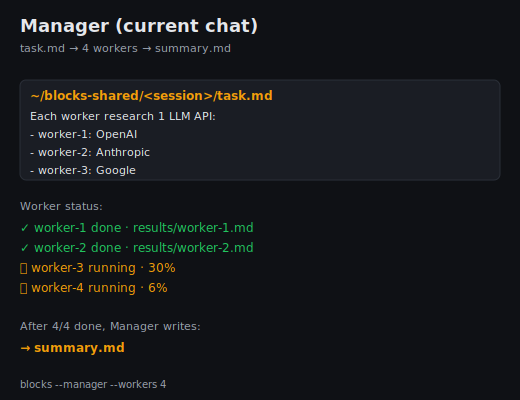
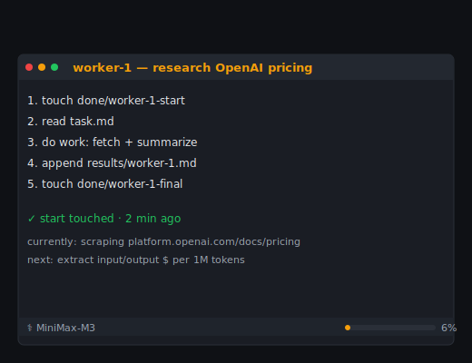
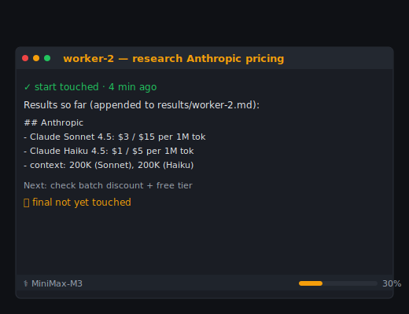
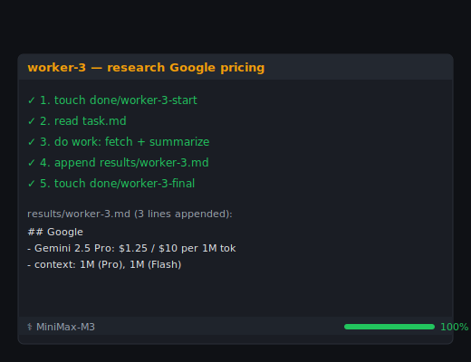
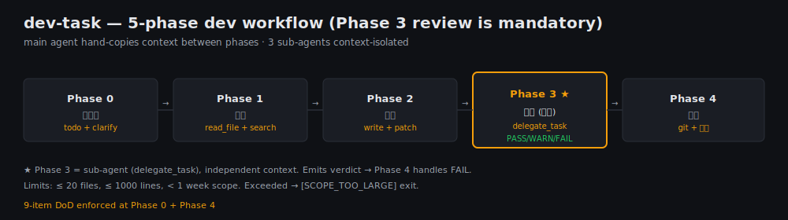
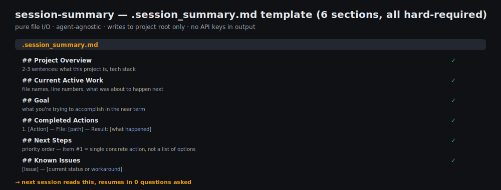

[English](README.md) | 中文

# Agent Skills

[](https://github.com/hooooolea/agent-skills)
[](LICENSE)
[](https://agentskills.io)

**三个 SKILL.md，跨 Hermes / Claude Code / Codex / Aider。** 任何支持 [SKILL.md 开放标准](https://agentskills.io/specification) 的 agent 都能装。

## 快速开始

分 3 步把 3 个 skill 装上:

1. **下载 SKILL.md 文件** — clone 仓库 (或只下你想要的几个文件夹):
   ```bash
   # 方式 A: 整仓 (能看源码、提 issue、发 PR)
   git clone https://github.com/hooooolea/agent-skills ~/agent-skills

   # 方式 B: 只要 tarball (无 git, 体积最小)
   curl -fsSL https://github.com/hooooolea/agent-skills/archive/refs/heads/main.tar.gz | tar xz
   ```

2. **复制到 agent 的 skills 目录**:

   | Agent | 路径 | 布局 |
   |-------|------|------|
   | Hermes | `~/.hermes/skills/` | 扁平: `<name>/SKILL.md` |
   | Claude Code | `~/.claude/skills/` | 需要 `<category>/<name>/` 子目录 |
   | Codex | `~/.codex/skills/` | 扁平: `<name>/SKILL.md` |
   | Aider | per-repo `.aider/skills/` | 扁平: `<name>/SKILL.md` |

   ```bash
   # Hermes / Codex / Aider (扁平)
   cp -r ~/agent-skills/skills/* ~/.hermes/skills/   # 或 ~/.codex/skills/

   # Claude Code (需要 category 子目录)
   cp -r ~/agent-skills/skills/agentic/blocks         ~/.claude/skills/blocks
   cp -r ~/agent-skills/skills/productivity/dev-task  ~/.claude/skills/dev-task
   cp -r ~/agent-skills/skills/productivity/session-summary ~/.claude/skills/session-summary
   ```

3. **重启 agent**, 在对话里说一句:
   - "用 2x2 跑 4 个 agent 对比 X" → 触发 `blocks`
   - "实现 / 开发 / 改代码" → 触发 `dev-task`
   - "session 收尾 / 存个档" → 触发 `session-summary`

> 💡 **不想手动复制?** Vercel 的 [`npx skills add hooooolea/agent-skills`](https://github.com/vercel-labs/skills) CLI 自动帮你 git clone + cp + 检测 agent (支持 50+ agents). 但它只是 wrapper, 不是必须 — SKILL.md 开放标准不需要任何工具就能跑.

- **开放标准** — 按 [agentskills.io spec](https://agentskills.io/specification) 写, 不绑定任何 vendor
- **零依赖** — 纯 Markdown + 可选 shell 脚本, 无需 npm / pip
- **小 footprint** — 每个 SKILL.md body ≤ 500 行 / ≤ 5000 tokens
- **可发现** — 仓库结构兼容 Vercel `npx skills` CLI / SkillsMP.com auto-index

## Skills

- **[blocks](skills/agentic/blocks/SKILL.md)** — 一个 tmux 窗口跑 N 个并行 AI agent (Manager + Workers 协调多步任务)

  | Manager (current chat) | worker-1 (start → work → append) |
  |:---:|:---:|
  |  |  |
  | **worker-2 (in progress, 30%)** | **worker-3 done / worker-4 running** |
  |  |  |

- **[dev-task](skills/productivity/dev-task/SKILL.md)** — 多子代理开发流 (5-phase: 拆任务→探索→编码→审查→收尾)

  

- **[session-summary](skills/productivity/session-summary/SKILL.md)** — session 结束前存个档, 下次接着干

  

## When NOT to use

3 个 skill 各自的边界:

### blocks
- 1 task 1 agent 就够 → `"$AGENT_CMD" -q "..."` 更快
- task < 5 min → Manager + N workers 的 overhead 太大
- 没 parallelizable 子任务 → 不用 N 个 worker 跑

### dev-task
- 改动 < 50 行 (单文件 trivial fix) → 直接改
- 不是 coding task (调研 / 写文档) → ad-hoc prompt 或 session-summary 收尾
- 不在 git repo (没 manifest) → 跑不了 (skill 强依赖 manifest)

### session-summary
- session < 30 min 简单任务 → 不用写, 自然结束
- task 1-2 步就完 → 没东西可总结

## Contributing

Issues / PRs 都欢迎. 改 SKILL.md 前先读 [agentskills.io spec](https://agentskills.io/specification). 跨 agent 兼容性的差异点统一在 [agent-compatibility.md](skills/agentic/blocks/references/agent-compatibility.md) 维护.

每个 PR 触发 CI 跑 [check-skill-spec.py](https://github.com/hooooolea/hermes-agent/blob/main/skills/software-development/hermes-agent-skill-authoring/scripts/check-skill-spec.py): description ≤ 1024 chars, name 匹配父目录, body ≤ 500 行, 无 `or types /<name>` 触发.

## Acknowledgments

- [Anthropic](https://www.anthropic.com/) — 发布 SKILL.md 开放标准
- [Vercel](https://vercel.com/) — `npx skills` CLI 跨 agent 安装
- [ComposioHQ](https://github.com/ComposioHQ/awesome-claude-skills) — 社区 curation
- [SkillsMP](https://skillsmp.com) — auto-index 公开 SKILL.md

## Community

没 Discord — 用 GitHub Issues / Discussions 凑合:
- [Issues](https://github.com/hooooolea/agent-skills/issues) — bug / feature request
- [Discussions](https://github.com/hooooolea/agent-skills/discussions) — Q&A / 想法

## Live site

GitHub Pages 镜像: <https://hooooolea.github.io/agent-skills/>

---

MIT
