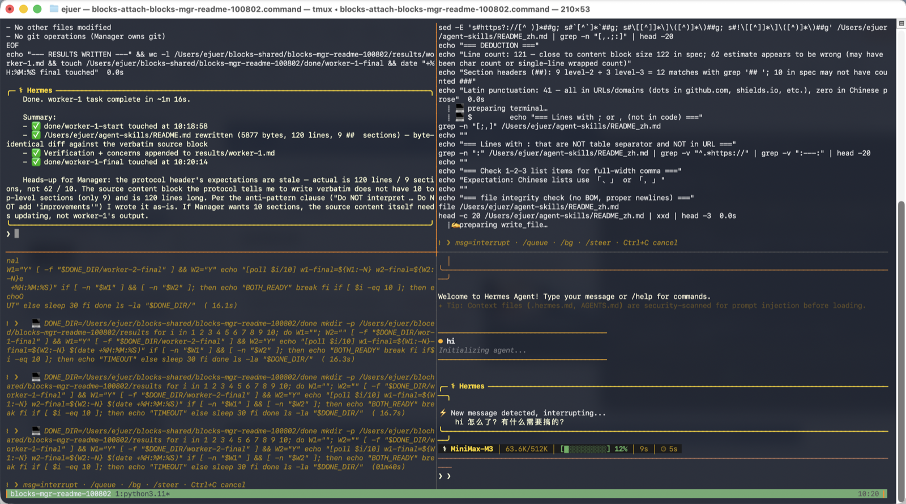

[English](README.md) | 中文

# Agent Skills

[](https://github.com/hooooolea/agent-skills)
[](LICENSE)
[](https://agentskills.io)

三个 SKILL.md 文件，实现开放的 [SKILL.md 标准](https://agentskills.io/specification)。任何支持该标准的 agent 都能安装：Hermes、Claude Code、Codex、Aider。

## 项目概览

一个简洁、聚焦的 skill 库，包含三个 skill：`blocks`、`dev-task`、`session-summary`。每个 skill 只需编写一次，即可被任何能读取 `SKILL.md` 的 agent 安装。无 vendor 锁定、无运行时依赖、无第三方包。仓库即真相之源：纯 Markdown 加可选 shell 脚本。

## 快速开始

分三步把三个 skill 装到任意 agent 上：

1. **下载 SKILL.md 文件** — clone 仓库（或只下载你想要的几个文件夹）：
   ```bash
   # 方式 A：git clone（给贡献者 — 能提 issue、发 PR）
   git clone --depth 1 https://github.com/hooooolea/agent-skills ~/agent-skills

   # 方式 B：tarball（给用户 — 无需 git，体积最小）
   mkdir -p ~/agent-skills && curl -fsSL https://github.com/hooooolea/agent-skills/archive/refs/heads/main.tar.gz | tar xz -C ~/agent-skills --strip-components=1
   ```

2. **复制到 agent 的 skills 目录**：

   | Agent | 路径 | 布局 |
   |-------|------|------|
   | Hermes | `~/.hermes/skills/` | 扁平：`<name>/SKILL.md` |
   | Claude Code | `~/.claude/skills/` | 扁平：`<name>/SKILL.md` |
   | Codex | `~/.codex/skills/` | 扁平：`<name>/SKILL.md` |
   | Aider | per-repo `.aider/skills/` | 扁平：`<name>/SKILL.md` |

   ```bash
   # 所有 agent 都用扁平 <name>/SKILL.md 布局。按你的 agent 修改 DEST：
   DEST=~/.hermes/skills        # Hermes
   # DEST=~/.claude/skills      # Claude Code
   # DEST=~/.codex/skills       # Codex
   # DEST=.aider/skills         # Aider（per-repo — 在项目目录里跑）

   cp -r ~/agent-skills/skills/agentic/blocks             "$DEST"/
   cp -r ~/agent-skills/skills/productivity/dev-task       "$DEST"/
   cp -r ~/agent-skills/skills/productivity/session-summary "$DEST"/
   ```

3. **重启 agent**，然后在对话里说一句：
   - `分块 2x2` / `blocks 2x2` → 触发 `blocks`
   - `实现` / `开发` / `改代码` → 触发 `dev-task`
   - `session summary` / `summarize` → 触发 `session-summary`

> 💡 **不想手动复制？** Vercel 的 [`npx skills add hooooolea/agent-skills`](https://github.com/vercel-labs/skills) CLI 自动帮你 git clone + cp + 检测 agent（支持 50+ agents）。但它只是 wrapper，不是必须 — SKILL.md 开放标准不需要任何工具就能跑。

- **开放标准** — 按 [agentskills.io spec](https://agentskills.io/specification) 编写，不绑定任何 vendor。
- **零依赖** — 纯 Markdown 加可选 shell 脚本，无需 npm 或 pip。
- **小 footprint** — 每个 SKILL.md 保持精简（目标：500 行以内）。
- **可发现** — 仓库结构兼容 Vercel `npx skills` CLI 与 SkillsMP.com auto-index。

## Skills

- **[blocks](skills/agentic/blocks/SKILL.md)** — 一个 tmux 窗口跑 N 个并行 AI agent（Manager + Workers 协调多步任务）。

  

- **[dev-task](skills/productivity/dev-task/SKILL.md)** — 多子代理开发流（5 阶段：拆任务 → 探索 → 编码 → 审查 → 收尾）。

  

- **[session-summary](skills/productivity/session-summary/SKILL.md)** — session 结束前存个档，下次接着干。

  

## 何时不该用

3 个 skill 各自的边界：

### blocks
- 1 个 task 1 个 agent 就够 → 直接用 `"$AGENT_CMD" -q "..."` 更快。
- task < 5 分钟 → Manager + N workers 的 overhead 太大。
- 没有可并行的子任务 → 没必要起 N 个 worker。

### dev-task
- 改动 < 50 行（单文件 trivial fix）→ 直接改。
- 不是 coding task（调研 / 写文档）→ 用 ad-hoc prompt 或包一层 session-summary。
- 项目缺少 manifest 文件（package.json / Cargo.toml / go.mod / pom.xml / requirements.txt）→ 跑不起来（skill 强依赖 manifest）。

### session-summary
- session < 30 分钟的简单任务 → 不用写，自然结束即可。
- task 1-2 步就完 → 没东西可总结。

## Contributing

Issues 和 PRs 都欢迎。改 SKILL.md 前先读 [agentskills.io spec](https://agentskills.io/specification)。跨 agent 兼容性的差异统一在 [agent-compatibility.md](skills/agentic/blocks/references/agent-compatibility.md) 维护。

每个 PR 触发 CI 跑 [check-skill-spec.py](https://github.com/hooooolea/hermes-agent/blob/main/skills/software-development/hermes-agent-skill-authoring/scripts/check-skill-spec.py)：description ≤ 1024 chars、name 匹配父目录、body ≤ 500 行、无 `or types /<name>` 触发。

详细贡献流程见 [CONTRIBUTING.md](CONTRIBUTING.md)。

## Acknowledgments

- [Anthropic](https://www.anthropic.com/) — 发布 SKILL.md 开放标准。
- [Vercel](https://vercel.com/) — `npx skills` CLI 跨 agent 安装。
- [ComposioHQ](https://github.com/ComposioHQ/awesome-claude-skills) — 社区 skill curation。
- [SkillsMP](https://skillsmp.com) — auto-index 公开 SKILL.md 文件。

## Community

没有 Discord，通过 GitHub Issues / Discussions 交流：

- [Issues](https://github.com/hooooolea/agent-skills/issues) — bug / feature request。
- [Discussions](https://github.com/hooooolea/agent-skills/discussions) — Q&A / 想法。

## Live site

GitHub Pages 镜像：<https://hooooolea.github.io/agent-skills/>

## License

MIT — 见 [LICENSE](LICENSE)。
